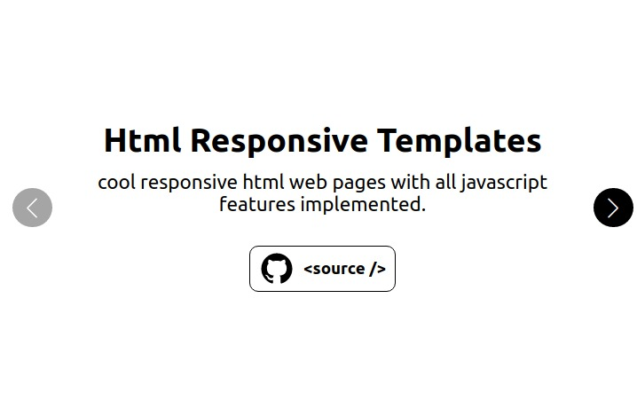

# Hi, I'm a frontend web developer.
I can build web applications for small to medium size business.
I'm targeting modern browsers for building blazing fast web apps.

I will build reusable Components with Reactjs or a Scalable/Maintainable SPA using React-Redux.

Also will convert web design into responsive HTML web pages, i like to use alpinejs to create javascript features for a multi-page application but still can work with jquery.

Have experience with other frameworks like Vuejs(Composition-API,Pinia) and SSG tools like AstroBuild.

## :zap: Tools and Skills
         
            

## :fire: My Experience
<table>
  <tr>
    <td valign="center">
      
    </td>
    <td valign="center">
      
    </td>
    <td valign="center">
      
    </td>
  </tr>
</table>

## :gem: Latest Posts
- <a href="https://dev.to/andrewzach/build-a-shopping-cart-with-alpinejs-3nkb">Build a Shopping Cart with Alpinejs.</a>
- <a href="https://dev.to/andrewzach/hard-time-with-image-attribute-loadinglazy-alpinejs-can-help-4a05">Images Lazy Loading with Alpinejs.</a>
- <a href="https://dev.to/andrewzach/basic-infinite-scroll-with-react-use-hooks-447l">Basic infinite scroll with react-use hooks</a>
- <a href="https://dev.to/andrewzach/how-to-make-animations-with-vuejs-jp2">How to make animations with Vuejs</a>
- <a href="https://dev.to/andrewzach/creating-a-multilingual-registration-form-with-vuejs-vee-validate-and-vue-i18n-c07">Creating a Multilingual Registration Form with Vuejs</a>
- <a href="https://dev.to/andrewzach/building-a-quiz-app-with-vuejs-pinia-12d6">Building a Quiz App with Vuejs Pinia</a>
- <a href="https://dev.to/andrewzach/creating-countdown-timer-with-vuejs-composables-m52">Creating Countdown Timer with Vuejs Composables</a>

## :skateboard: Currently hacking on
- Keep up with AI APIs/Applications and optimize my workflow to consume their power.

## :speech_balloon: Contacts
- :envelope: andrew.saeed.zachary@gmail